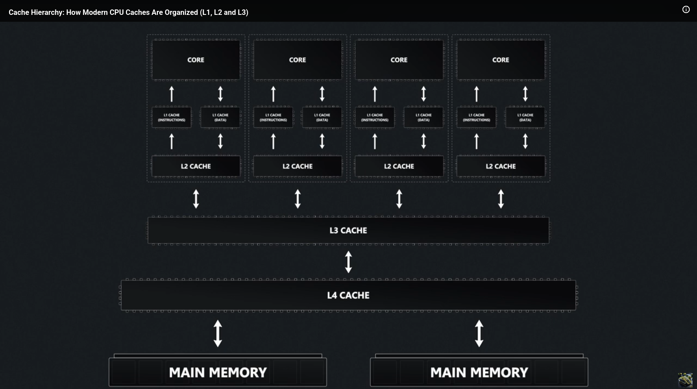

# M-C-Analysis
Analysis of Memory and Cache performances in Linux When working with a memory intensive program 

---

**Memory & Cache Architecture and Hierarchy in modern CPU**




+ L1 cache:
  + Size: Smallest cache (16KB - 128KB)
  + Associativity: has the associativity between 2-8 ways
  + Latency: Fastest cache, 1 - 3 cycles
+ L2 cache:
  + Size: Slightly larger than L1 cache, 256KB - 2MB
  + Associativity: 4 - 16 ways
  + Latency: 4 - 10 cycles
+ L3 cache:
  + Size: Largest cache in most architectures, 2MB - 32MB per core
  + Associativity: 16 ways
  + Latency: Longest, 10 Cycles - 40 Cycles 

**What are cache misses**


In several scenarios, cache misses might appear inconsequential at first glance, but can lead to substantial performance degradation. When our program encounters frequent cache misses, it waits to fetch data from the main memory. This causes unnecessary execution delays. Therefore, effectively monitoring and mitigating cache misses becomes important


**My Setup:**

I'm using two VM one of them is a arm64 debian 13 and the othe rone is an amd64 debian 13 and they are being hosted on an amd64 debian 13 host:


---

# Memory and Cache performance analysis using `perf`:

+ `perf mem`
  

+ `perf stat`
  + `perf stat -B -e cache-references,cache-misses,cycles,instructions,branches,faults,migrations <some command run (sleep 5)>`
    + `-e` -> allows us to specify a set of events we wish to monitor
    + 

---

# Systems memory structure analysis

> This part can differ for different systems (It is my own system's description)


Well first of all let's check the caches' size of our hosts:

by using the command below we can check the caches' size in our host machine:

```bash
lscpu | grep -i cache
```

The result (It's for my hardware only ):

```

L1d cache:                               352 KiB (10 instances)                    
L1i cache:                               576 KiB (10 instances)                    
L2 cache:                                6.5 MiB (4 instances)                     
L3 cache:                                12 MiB (1 instance)   

```
+‌ L1d Cache (352 KiB, 10 instances): This is the level 1 Data cache. It stores the actual data our CPU is actively processing

+ L1i -(575 KiB, 10 instances) -> This is the level 1 instruction cache. It stores the code/instructions telling the CPU waht to do with the data
  + "10 instances" -> means ew have 10 distinct physical CPU cores that each get their very own dedicated L1 cache.
+ L2 cache (6.5 MiB, 4 instances)
  + "4 instances" -> our CPU architecture groups cores together. Instead of every core getting its own L2, clusters of cores share on L2 cache pool, or we have a mix of performance and efficiency cores sharing them

Something funny I've faced with, I have 12 core cpu based on the command `nproc` but in the above report we're observing that we have 10 instances of L1 cache and we've gotta ask this question: WAS IT NOT SUPPOSED TO BE ONE L1 CACHE PER EACH CORE?

> The funny thing is that when `nproc` returns 12, it isn't telling us how many physical cores we have; it's telling us how many **logical cores(processing threads)**  Linux can schedule tasks on.
> Our CPU actually has exactly 10 physical cores, which perfectly matches our 10 instances L1 cahce.

Intel splits these 10 physical cores into two different teams to balance power and battery life:
1. 2 Performance Cores (P-Cores): These are beefy, high-speed cores meant for heavy lifting. They feature Hyper-Threading, meaning each physical core acts as 2 logical threads (2*2 = 4).
2. 8 Efficient Cores (E-Cores): These handle lighter background tasks to save energy. They do not have Hyper-Threading, so 1 physical core equals exactly 1 logical thread(8 * 1 = 8).

Why L2 cache has only 4 instances:
E-cores are grouped into "clusters" of 4, and each cluster shares a single block of L2 cache:
+ 2 instances of L2 cache (1 dedicated to each of the 2 P-cores)
+ 2 instances of L2 cache (1 shared for each cluster of 4 E-cores, covering all 8 E-cores)
+ Total = 4 instances of L2 cache!

> For more detailed report you can use this command: `sudo dmidecode -t cache`.


## Deterministic Host Configuration & CPU/Cache Pinning Blueprint

When we run a memory tracing, we want every cache miss, every TLB fault, every page walk latency we measure to because by the virtualization mechanism under test, not by the host OS scheduler accidentally moving a vCPU thread from core 2 to core 5 mid-benchmark, evicting our carefully warmed L2 cache in the process.


There are three distinct interference sources we're eliminating, in order of severity:

1. **Cache Eviction from Thread Migration** If the host scheduler migrates a QEMU vCPU thread between physical cores, the L1 and L2 caches on the original core go cold. O next cache miss measurement now includes "cache cold from migration" noise on top of the actual virtualization overhead we're trying to measure. L1/L2 are per-core, crossing cores means starting from scratch.

2. **Shared Core Interference** If a host OS thread (say, a kernel worker, `kworker`, or our SSH session) shares a physical core with a vCPU thread, it competes for the same L1/L2 cache. Every time that host thread runs, it evicts guest working-set cache lines. Our LLC miss numbers then reflect host thread pullution, not guest behavior.

3. **Cross-NUMA Node Memory Latency** If our vCPU thread is pinned to a core on NUMA node 0, but the physical memory backing the guest RAM was allocated on NUMA node 1, every single guest memory access pays a remote NUMA penalty (typically 30-100ns extra per access). This completely drowns out the EPT vs SoftMMU signal we're trying to isolate.

**The end state we're building toward**:

```
Physical Core 0-1 -> Host OS, IRQs, SSH, everything else
Physical Core 2-3 -> KVM VM vCPU threads ONLY
Physical Core 4-7 -> QEMU TCG vCPU threads ONLy(TCG needs more cores - software emulation is heavier)

All memory for both VMs -> allocated on the SAME NUMA node as their pinned cores.

```


### Understanding Physical Hardware First:

To pin CPU intelligently we have to know the actual topology of our machine we need to answer four questions:

+ How many physical cores do we have and how are they numed.
+ which cores share L2 caches with each other
+ How many NUMA nodes exist, and which cores belong to each 
+ Are there hyperthreads, and if so what is the sibling mapping.

```bash
lstopo
```


```bash
nproc --all
```
```
12
```


```bash
lscpu | grep -E "^CPU\(s\)|^Core|^Socket|^Thread|^NUMA|Model name"
```
```
CPU(s):                                  12
Model name:                              12th Gen Intel(R) Core(TM) i5-1235U
Thread(s) per core:                      2
Core(s) per socket:                      10
Socket(s):                               1
CPU(s) scaling MHz:                      32%
NUMA node(s):                            1
NUMA node0 CPU(s):                       0-11
```

```bash
cat /sys/devices/system/cpu/cpu0/cache/index2/shared_cpu_list
```
```
0-1
```

```bash
numactl --hardware
```
```
available: 1 nodes (0)
node 0 cpus: 0 1 2 3 4 5 6 7 8 9 10 11
node 0 size: 15698 MB
node 0 free: 5580 MB
node distances:
node     0 
   0:   10 
```

We have an Intel 12th Gen i5-1235U. Looking at the `lstopo`diagram reveals it clearly.

Cores 0 and 1 are performance cores. Each has 2 hyperthreads. L1d is 48 KB, L1i is 32KB, L2 is 1280KB.

Cores 2-9:
These are efficiency cores, each has only 1 logical CPU, no hyperthreading. L1d is 32KB and L1i is 64KB. Notice the L2 grouping from the diagram: cores 2-5 share one 2048KB L2, and cores 6-9 share another 2048KB L2.

To prevent the KVM VM's cache activity from pollyting the TCG VM's L2 and vice versa, we should put each VM in a different L2 clusters.


Based on the explanations the scheme we're going to have is like below:
```
┌──────────────────────────────────────────────────────────────────────┐
│  CPU0+CPU1  (P-core #0 HT pair, L2: 1280KB)  ─┐                      │
│  CPU2+CPU3  (P-core #1 HT pair, L2: 1280KB)  ─┴──  HOST ZONE         │
│                                                    IRQs, kernel,     │
│                                                    SSH, desktop      │
├──────────────────────────────────────────────────────────────────────┤
│  CPU4+CPU5+CPU6+CPU7  (E-cluster A, L2: 2048KB) ──  KVM ZONE         │
│                                                    2 vCPUs pinned    │
│                                                    here, L2 is       │
│                                                    private to KVM    │
├──────────────────────────────────────────────────────────────────────┤
│  CPU8+CPU9+CPU10+CPU11  (E-cluster B, L2: 2048KB) ── TCG ZONE        │
│                                                    2 vCPUs + helper  │
│                                                    threads pinned    │
│                                                    here, L2 private  │
│                                                    to TCG            │
└──────────────────────────────────────────────────────────────────────┘
```


In this scheme, each VM gets its own dedicated L2 cluster with zero sharing with the other VM or the host. The two VM cannot evict each other's cache lines at L2. The host P-cores have their own seperate L2s entirely. The L3 (12MB) is still shared across averything. That is unavoidable on a single-socket cunsumer CPU, but L1 and L2 are now fully isolated per zone.


**Now it's time for Isolation baby!!**

Now here we are going to write the actual isolation parameters.

we should change the `/etc/default/grub` file:

We should add this line:
```
GRUB_CMDLINE_LINUX="isolcpus=4-11 nohz_full=4-11 rcu_nocbs=4-11 irqaffinity=0-3"
```

+ `isolcpus=4-11` -> Remove CPUs 4-11 from the kernel's general purpose scheduler domain. the scheduler will not place any tasks on these CPUs.
+ `nohz_full=4-11` -> Normally the kernel fires a scheduler tick interrupt (typically 250 Hz on Debian) on every CPU to preempt tasks and rebalance load. On isolated CPUs running a single pinned task, this tick causes unnecessary interruptions. `nohz_full` suppresses this tick when only task in running on that CPU, reducing interrupt-driven cache pollution.
+ `rcu_nocbs=4-11` -> Read-Copy-Update (RCU) is a kernel synchronization mechanism that prediocally runs callback work on CPUs. Without this parameters, RCU callbacks can fire on our isolated CPUs mid-benchmark, evicting cache lines. This offloads those callbacks to non-isolated CPUs
+ `irqaffinity=0-3` -> Hardware interrupt delivery defaults to any CPU. This pins all IRQ delivery to only CPUs 0-3 (our host zone), ensuring no device interrupt wakes up and runs on our VM-dedicated CPUs.

and for it to apply we shoudl update the grub configurations and reboot our system


To check if the isolation has happened we can use the below commands:
```bash

cat /proc/cmdline

cat /sys/devices/system/cpu/isolated
cat /sys/devices/system/cpu/nohz_full

ps -eo psr,pid,comm --no-headers | sort -n | awk '
{count[$1]++}
END {for (cpu in count) printf "CPU%s: %d threads currently scheduled\n", cpu, count[cpu]}
' | sort -t'U' -k1 -n

cat /proc/interrupts | awk 'NR==1{print; next} {
    split($0, a, " "); 
    total=0; for(i=2;i<=13;i++) total+=a[i]; 
    if(total>0) print
}' | head -30
```

As we check the interrupts, we check that nearly all the interrupts happen in the cores 0-3 buttt there are some interrupts that happens in cores that were not suppose to happen.
Wifi driver queues (IRQs 176-183) are currently delivering interrupts onto CPUs4-11 which is in our isolation zones. This happens because the WiFi driver (`iwlwifi`) creates one interrupt queue per CPU at load time, ignoring `irqaffinity`. 

Moving all iwlwifi IRQs back to CPUs 0-3:
```bash
for irq in $(grep iwlwifi /proc/interrupts | awk -F: '{print $1}' | tr -d ' '); do
    echo -n "Moving IRQ $irq to CPUs 0-3: "
    echo "f" | sudo tee /proc/irq/${irq}/smp_affinity
done
```


> just one other thing the `nocloud` images does not have default passowrd and. If we boot them as is we'll get a login prompt with no credentials. The simplest thing to do is to set a root password directly into the image before booting:

```bash
sudo virt-customize -a /home/taha/Public/Distros/kvm-lab.qcow2 \
    --root-password password:trace \
    --hostname kvm-lab \
    --run-command 'systemctl enable serial-getty@ttyS0.service'

sudo virt-customize -a /home/taha/Public/Distros/tcg-lab.qcow2 \
    --root-password password:trace \
    --hostname tcg-lab \
    --run-command 'systemctl enable serial-getty@ttyS0.service'

```

**Launching the VMs**:

KVM VM:

```bash
sudo qemu-system-x86_64 \
  -enable-kvm \
  -cpu host \
  -smp 2,sockets=1,cores=2,threads=1 \
  -m 2G \
  -drive file=/home/taha/Public/Distros/kvm-lab.qcow2,format=qcow2,if=virtio \
  -drive if=pflash,format=raw,readonly=on,file=/usr/share/OVMF/OVMF_CODE_4M.fd \
  -drive if=pflash,format=raw,file=/usr/share/OVMF/OVMF_VARS_4M.fd \
  -nographic \
  -serial mon:stdio \
  -netdev user,id=net0,hostfwd=tcp::2222-:22 \
  -device virtio-net-pci,netdev=net0 \
  -name "kvm-lab,process=kvm-lab" \
  -pidfile /tmp/kvm-lab.pid
```

+ enable-kvm          → activates hardware virtualization via /dev/kvm
+ cpu host            → guest CPU = exact copy of host CPU (exposes real PMU events)
+ smp 2               → 2 vCPUs (maps to 2 host threads we will pin to CPUs 4,5)
+ m 2G                → 2GB RAM (enough for workloads, leaves room for TCG)
+ nographic           → no display window, all output via serial
+ serial mon:stdio    → serial console + QEMU monitor in the same terminal


TCG VM:
```bash
sudo qemu-system-aarch64 \
  -machine virt,gic-version=3 \
  -cpu cortex-a72 \
  -smp 2,sockets=1,cores=2,threads=1 \
  -m 2G \
  -drive file=/home/taha/Public/Distros/tcg-lab.qcow2,format=qcow2,if=virtio \
  -bios /usr/share/qemu-efi-aarch64/QEMU_EFI.fd \
  -nographic \
  -serial mon:stdio \
  -netdev user,id=net0,hostfwd=tcp::2223-:22 \
  -device virtio-net-pci,netdev=net0 \
  -name "tcg-lab,process=tcg-lab" \
  -pidfile /tmp/tcg-lab.pid
```

+ machine virt        → ARM64 platform (no KVM flag = TCG automatically)
+ cpu cortex-a72      → emulate a specific ARM core (deterministic instruction set)
+ smp 2               → 2 guest vCPUs (TCG uses more host threads than this)
+ m 2G                → 2GB RAM
+ nographic + serial  → same console approach

Every VM is represented with a process now we're going to check what their process id is on the host machine:

```bash
cat /tmp/kvm-lab.pid
cat /tmp/tcg-lab.pid
```

And the best practice can be that we set the process ids as environment variables.


Now these VM that we have created is supported by bunch of proesses and we're gonna see which processes there are, for observing these processes we're gonna use the command below:

```bash
ps -T -p <KVM/TCG_PID> -o spid,comm 
```

> SPID -> System process ID, (or more accurately, Thread ID) -> Unique identifier assigned by the linux kernel to an individual kernel rather than overall process.

```
SPID COMMAND
55066 kvm-lab -> main QEUMU process thread
55067 qemu-system-x86 -> vCPU0 (The actual KVM execution thread)
55069 kvm-lab -> vCPU1
55070 kvm-lab -> QEUMU I/O thread
55073 kvm-nx-lpage-re -> NX large page recovery worker (KVM internal)
```

```
SPID COMMAND
46375 tcg-lab -> QEMU main thread
46376 qemu-system-aar -> vCPU0 (TCG translation + execution loop)
46378 tcg-lab -> vCPU1
46379 tcg-lab -> QEMU I/O thread
```

The resaon that we can observe less threads for TCG comparing to KVM is that because there's no hypervisor kernel component everything runs in userspace.

Now we should pin all of these threasds to those cores that we isolated before:

For KVM we pin threads from cores 4 to 7:
```bash
sudo taskset -cp 4 55067
sudo taskset -cp 5 55069
sudo taskset -cp 6 55066
sudo taskset -cp 6 55070
sudo taskset -cp 7 55073
```

And for TCG we map threads to cores 8-11:
```bash
sudo taskset -cp 8 46376
sudo taskset -cp 9 46378
sudo taskset -cp 10 46375
sudo taskset -cp 10 46379
```   


## KVM

Kernel-based Virtual Machine, is a linux **kernel module** that turns the Linus OS into a **Type 1 hypervisor.** It uses hardware virtualization extensions built into modern CPUs, specifically Intel VT-x and AMD-V, to allow virtual machinesto run with near-native performance.


> KVM does not run virtual machines by itself. It exposes the hardware virtualization capabilities of the CPU to user-space programs.

It provides bunch of kernel interfaces allowing VMMs(Virtual Machine Monitor) like QEMU or Firecracker to use hardware level CPU isolation for each VM.

> Witout a user-space program on to, KVM does nothing visible

**What it Provides:**
+ Kernel-level hardware virtualization using VT-x or AMD-V
+ Near-native CPU performance for virtual machines 
+ Memory isolation between VMs is enorced by the hardware
+ The foundation that QEMU, Firecracker, and .. containers build on.

**What it does not provide:**
+ Device emulation (no network, disk, or display)
+ A user interface or management layer
+ Cross-architectre support (KVM requires host and gyest to share the same CPU architecture)

## QEMU

Quick Emulator, is a machine emulator and visualizer. It emulates complete computer system, including CPU, memory, disk, network, and other hardware devices entirely in **software**. It means that QEMU is capable of running a guest VM with an OS designed for ARM on an x86 host, or emulate a RISC-V system on AMD hardware, **without any modification to the guest**.

When it runs without KVM all CPU instructions should be translated into host machine's language and this translation happens in **Software** using its internal Tiny Code Generator (TCG). This makes virtualization extremely flexible but the translation makes it very slow.When QEMU runs with KVM, it offloads CPU virtualization to the kernel module and uses hardware acceleration, reducing overhead to near-native levels. It handles and manages everything KVM cannot like **device enumation**, **disk I/O**, **Networking**, **display output**, and **VM lifecycles management.**

**What it provides:**
+ Full system emulatio, including CPU, memory (when there is no KVM), disk and network
+ Corss-architecture support thanks to TCg for development and testing.
+ Device emulation using VirtIO paravirtualized drivers for near-native I/O performance
+ Snapshotting, live migration, and state save/restore
+ The user-space component that makes VM usable in practice


## EPT

Each VM operates as if it has it's own physical memory space, with its guest OS managming page tables. However since multiple VMs are running on a same host/physical machine, the guest physical address must be translated into host physical address this is where memory management becomes more complicated.
Previously it was handled by **shadow page tables**. The shadow page table is a duplicate of the guest's page table that maps guest virtual address **directly** to host physical address. While this reduces overhead during memory access once it's set up, it introduces significant complexity in maintaining consistency between the guest's page table and the shadow page table. Any change in the guest's memory would require synchronization with the shadow's page table, adding considerable overhead through frequent traps to the hypervisor.


To address these inefficiencies, hardware-based support for memory virtualization was introduced in the form of Extended Page table (EPT). It simplifies the translation process by eliminating the need for shadow page tables and instead relies on **hardware** to handle memory translation more directly

In EPT enabled systems, we've got two translation levels:
1. Guest Virtual -> Guest Physical
2. Guest Physical -> Host Physical 

Steps into use of EPT:
1. Initial Lookup: Guest OS maintains a register calls `CR3`, pointing to it's page tables' root. When an application within the guest OS tries to access a memory address, the guest OS will lookup it's virtual address in its page tables and translate it into guest physical address
2. EPT Root Lookup: The hypervisor, which controls the virtual machine, provides an EPT root register that points to the base of the extended page tables. This new register allows the hardware to automatically manage the translation from guest physical to host physical address.
3. Guest physical to host physical: This translation is done without the involvement of the OS, allowing the entire process to be offloaded to the hardware.
4. TLB Integration: TLB is updated to reflect the final mapping from guest virtual to host physical. A key advantage that EPT has got is that the TLB now includes an ID for each VM, preventing the need to flush the TLB during VM context switch.


> EPT is a multi-tiered page table stored in memory, and maintained by the hypervisor.

## TCG


## Scenario. Cache Hierarchy Stress (Cache line bouncing & LLC Eviction Patterns)

In this scenario we tend to create a working set that exceeds L3 cache size using a memory access pattern that produces maximum cache line utilization contrast between native and emulated execution.

**Why it differentiates KVM vs TCG:**
+ In the KVM case, guest cache behavior maps almost 1:1 to host physical cache behavior. The hardware prefetcher operates normally; we'll see the real cache hierarchy underload.
+ In the Qemu TCG case, cache behavior is fundamentally distorted. Every memory access instruction in the ARM64 guest is translated by TCG inot an x86 instruction sequence that includes a software TLB lookup before the actual memory access. This means the actual memory access pattern seen by the host's L1/L2/L3 hardware caches includes both the guest's intended access AND the TCG metadata accesses (TLB table enteries, TranslationBlock structures), polluting the cache footprint substantially.

> SoftMMU: a QEMU feature that implements memory management and address translation in software rather than relying on host hardware. It powers QEMU's full system emulation, allowing users to run complete, unmodified  guest operating systems by simulating a hardware Memory Management Unit and Translation Lookaside Buffer 

The benchmark code:
```c
// workload_cache_stress.c — matrix transpose exceeding L3
// gcc -O2 -o cache_stress workload_cache_stress.c -lm
#include <stdio.h>
#include <stdlib.h>
#include <string.h>
#include <time.h>

// Size chosen to exceed typical 8-32MB L3 caches
// 8192 * 8192 * 8 bytes = 512MB working set
#define N       8192
#define BLOCK   64      // Cache-line-aware blocking size (64 = typical line size)

static double A[N][N];
static double B[N][N];
static double C[N][N];

// ── Blocked matrix transpose: exposes cache line reuse within blocks ──
// Without blocking: column accesses in B cause a cache miss per element
// With BLOCK=64: each block fits in L1, but inter-block access still thrashes LLC
void transpose_blocked(double dst[N][N], double src[N][N]) {
    for (int ii = 0; ii < N; ii += BLOCK) {
        for (int jj = 0; jj < N; jj += BLOCK) {
            int imax = ii + BLOCK < N ? ii + BLOCK : N;
            int jmax = jj + BLOCK < N ? jj + BLOCK : N;
            for (int i = ii; i < imax; i++) {
                for (int j = jj; j < jmax; j++) {
                    dst[j][i] = src[i][j];
                }
            }
        }
    }
}

// ── Pointer-chase array: defeats hardware prefetcher entirely ─────────
// Random linked-list walk: each load depends on previous = serial miss chain
#define CHASE_SIZE  (1 << 24)   // 16M entries = 128MB (> L3 on most systems)
static size_t chase_array[CHASE_SIZE];

void init_pointer_chase(void) {
    // Fisher-Yates shuffle to create random permutation
    for (size_t i = 0; i < CHASE_SIZE; i++) chase_array[i] = i;
    srand(12345);
    for (size_t i = CHASE_SIZE - 1; i > 0; i--) {
        size_t j = (size_t)rand() % (i + 1);
        size_t tmp = chase_array[i];
        chase_array[i] = chase_array[j];
        chase_array[j] = tmp;
    }
}

volatile size_t run_pointer_chase(long steps) {
    volatile size_t idx = 0;
    for (long i = 0; i < steps; i++) {
        idx = chase_array[idx];   // Load-use dependency: serializes misses
    }
    return idx;
}

int main(void) {
    struct timespec t0, t1;

    // Initialize matrices with non-trivial values
    for (int i = 0; i < N; i++)
        for (int j = 0; j < N; j++) {
            A[i][j] = (double)(i * N + j) * 0.0001;
            B[i][j] = 0.0;
        }

    // ── Phase 1: Blocked transpose (tests L1/L2/L3 hierarchy) ─────────
    printf("Phase 1: Blocked Matrix Transpose (%dx%d, %.0fMB working set)...\n",
           N, N, (double)(2 * N * N * 8) / (1024 * 1024));
    clock_gettime(CLOCK_MONOTONIC, &t0);
    transpose_blocked(B, A);
    clock_gettime(CLOCK_MONOTONIC, &t1);
    long ns1 = (t1.tv_sec - t0.tv_sec) * 1e9 + (t1.tv_nsec - t0.tv_nsec);
    printf("  Transpose: %.3f sec | Throughput: %.2f GB/s\n",
           ns1 / 1e9, (2.0 * N * N * 8) / (ns1 / 1e9) / 1e9);

    // ── Phase 2: Pointer-chase (tests LLC miss latency serialized) ─────
    printf("Phase 2: Pointer-Chase Array (%zuMB, defeating prefetcher)...\n",
           CHASE_SIZE * sizeof(size_t) / (1024 * 1024));
    init_pointer_chase();
    clock_gettime(CLOCK_MONOTONIC, &t0);
    volatile size_t result = run_pointer_chase(50000000L);
    clock_gettime(CLOCK_MONOTONIC, &t1);
    long ns2 = (t1.tv_sec - t0.tv_sec) * 1e9 + (t1.tv_nsec - t0.tv_nsec);
    printf("  Pointer-chase: %.3f sec | Avg latency: %.1f ns/op | result=%zu\n",
           ns2 / 1e9, (double)ns2 / 50000000.0, result);

    return 0;
}
```

This scenario with this code has two distinct phases that stress different levels of the cache hierarchy for different reasons.

The first phase of the code above targets L1/L2/L3 in a controlled, predictable pattern. the read pattern is cache friendly and would not put so much pressure on it and it is sequential, but the write pattern is not cache friendly and is strided by the full row width. At 8192*8192 doubles the working set is 1024MB, which is so much larger than our 12MB L3 cache. And this is gonna guarantee that no matter how good the prefetcher is, the vast majority of accesses must go to DRAM. The blocking parameter controls how much of the working set fits in L1 during the innermost loop.
The second phase which targets memory latency in isolation by constructing a random linked list through a 128MB array. Each load depends on the result of the previous load, this is a load-use dependency chain and it completely defeats the hardware prefetcher ecause the next address to fetch is unknown until the current fetch completes. This measure pure memory access latency rather than bandwidth.


For tracing we run the below commands in host for each of them one by one:

KVM:

```bash
ssh -i ~/.ssh/id_lab -p 2222 root@localhost "./cache_stress" > ~/perf-results/kvm_workload.txt 2>&1 &
KVM_SSH_PID=$!

sudo perf stat -e \
cycles,instructions,\
cache-misses,cache-references,\
mem-stores,\
mem_load_uops_retired.l3_hit,\
mem_bound_stalls.load_llc_hit,\
ocr.demand_data_rd.l3_hit,\
uncore_imc_free_running/data_read/,\
uncore_imc_free_running/data_write/,\
uncore_imc_free_running/data_total/,\
topdown-bad-spec,topdown-be-bound,\
topdown-retiring,topdown-fe-bound \
-C 4-7 -o ~/perf-results/kvm_perf.txt -- sleep 10 &


wait $KVM_SSH_PID && echo "KVM workload done"
```


The result of this:

```
 Performance counter stats for 'CPU(s) 4-7':                                                                    
                                                                                                                
       413,985,074      cpu_atom/cycles/                                                        (58.23%)        
        59,282,724      cpu_atom/instructions/           #    0.14  insn per cycle              (66.59%)        
         4,625,056      cpu_atom/cache-misses/           #   37.02% of all cache refs           (66.63%)        
        12,494,904      cpu_atom/cache-references/                                              (66.67%)        
         9,482,792      cpu_atom/mem-stores/                                                    (66.72%)        
           305,349      cpu_atom/mem_load_uops_retired.l3_hit/                                        (66.74%)  
        12,206,278      cpu_atom/mem_bound_stalls.load_llc_hit/                                        (66.73%) 
           472,106      cpu_atom/ocr.demand_data_rd.l3_hit/                                        (66.73%)     
        128,102.17 MiB  uncore_imc_free_running/data_read/                                                      
         38,656.58 MiB  uncore_imc_free_running/data_write/                                                     
        167,006.53 MiB  uncore_imc_free_running/data_total/                                                     
       298,859,240      cpu_atom/topdown-bad-spec/                                              (49.99%)        
       814,821,896      cpu_atom/topdown-be-bound/                                              (49.96%)        
       100,441,234      cpu_atom/topdown-retiring/                                              (49.92%)        
       846,823,989      cpu_atom/topdown-fe-bound/                                              (49.90%)        

      10.003866471 seconds time elapsed                                                                          

```


And for TCG:

```bash
ssh -i ~/.ssh/id_lab -p 2223 root@localhost "./cache_stress" > ~/perf-results/tcg_workload.txt 2>&1 &
TCG_SSH_PID=$!

sudo perf stat -e \
cycles,instructions,\
cache-misses,cache-references,\
mem-stores,\
mem_load_uops_retired.l3_hit,\
mem_bound_stalls.load_llc_hit,\
ocr.demand_data_rd.l3_hit,\
uncore_imc_free_running/data_read/,\
uncore_imc_free_running/data_write/,\
uncore_imc_free_running/data_total/,\
topdown-bad-spec,topdown-be-bound,\
topdown-retiring,topdown-fe-bound \
-C 8-11 -o ~/perf-results/tcg_perf.txt -- sleep 50 &

wait $TCG_SSH_PID && echo "TCG workload done"
```

The result:

```
 Performance counter stats for 'CPU(s) 8-11':                                                                   
                                                                                                                
     1,766,784,142      cpu_atom/cycles/                                                        (58.33%)        
       158,348,525      cpu_atom/instructions/           #    0.09  insn per cycle              (66.66%)        
        13,200,134      cpu_atom/cache-misses/           #   40.66% of all cache refs           (66.66%)        
        32,463,198      cpu_atom/cache-references/                                              (66.66%)        
        25,255,214      cpu_atom/mem-stores/                                                    (66.65%)        
         1,116,479      cpu_atom/mem_load_uops_retired.l3_hit/                                        (66.66%)  
        43,346,779      cpu_atom/mem_bound_stalls.load_llc_hit/                                        (66.67%) 
         1,504,248      cpu_atom/ocr.demand_data_rd.l3_hit/                                        (66.68%)     
        487,521.74 MiB  uncore_imc_free_running/data_read/                                                      
        107,584.08 MiB  uncore_imc_free_running/data_write/                                                     
        595,001.17 MiB  uncore_imc_free_running/data_total/                                                     
     1,194,753,818      cpu_atom/topdown-bad-spec/                                              (50.01%)        
     3,487,402,114      cpu_atom/topdown-be-bound/                                              (50.01%)        
       350,002,280      cpu_atom/topdown-retiring/                                              (50.00%)        
     3,770,225,048      cpu_atom/topdown-fe-bound/                                              (49.99%)        

      50.005090977 seconds time elapsed        
```

Metrics explained in the `perf stat`:

+ `cylcles` + `instructions` -> These two shows IPC  which tells us how much useful work the CPU completes per clock tick. low IPC means the pipeline is stalling, waiting for memory, waiting for branch resolution, or waiting for the next instruction.
+ `cache-misses` + `cache-references` -> Miss rate cache references is the total number of last-level cache accesses. Cache misses is how many of those had to go to DRAM. The ratio gives us cache miss rate
+ `mem-stores`: Counts retired sotre instructions. Stores are revealing for TCG because of the softMMU must write update TLB entries back to the software TLB table on every translation
+ `topdown-be-bound`: pipeline stalled waiting for execution resources, primarily memory. A high backened bound means the CPU is spending most of its waiting for data to arrive from cache or DRAM rather than doing computation.
+ `topdown-fe-bound`: pipeline stalled waiting for instructions to be fetched and decoded. High frontend bound in TCG reveals that the TCG-generated x86 code is stressing the instruction cache and branch predictor with its dense TLB-check instruction sequences.
+ `dtlb_load_misses`:  also not supported on E-cores. This would have been the most direct TLB pressure metric but the hardware doesn't expose it on Gracemont.
+ `mem-loads`: showed zero in every previous run, indicating the E-core PMU's mem-loads counter requires PEBS (Processor Event Based Sampling) which is not available on E-cores. We dropped it because zeros add no information.


---

Running some new tests and benchmarks and getting new results:


```bash

ssh -i ~/.ssh/id_lab -p 2222 root@localhost "./benchmarks/pc-mm" > ~/perf-results/kvm_workload_pc_mm.txt 2>&1 &
KVM_SSH_PID=$!

sudo perf stat -e \
mem_load_retired.l1_hit,\
mem_load_retired.l2_hit,\
mem_load_retired.l3_hit,\
mem_load_retired.l3_miss,\
mem_load_retired.fb_hit,\
mem_inst_retired.all_loads,\
mem_inst_retired.all_stores,\
mem_inst_retired.stlb_miss_loads,\
mem_inst_retired.stlb_miss_stores,\
dtlb_load_misses.walk_completed,\
dtlb_load_misses.walk_completed_4k,\
dtlb_load_misses.walk_pending,\
dtlb_load_misses.stlb_hit,\
dtlb_store_misses.walk_completed,\
dtlb_store_misses.stlb_hit,\
l1d.replacement,\
l1d_pend_miss.pending_cycles,\
l2_rqsts.demand_data_rd_hit,\
l2_rqsts.demand_data_rd_miss,\
longest_lat_cache.miss,\
longest_lat_cache.reference,\
uncore_imc_free_running/data_read/,\
uncore_imc_free_running/data_write/,\
uncore_imc_free_running/data_total/,\
cycles,instructions,\
cache-misses,cache-references,\
topdown-be-bound,topdown-fe-bound,\
topdown-mem-bound \
-C 2 \ -o ~/perf-results/kvm_perf_pc_mm.txt -- sleep 30 &

wait $KVM_SSH_PID && echo "KVM workload done"

```

---
---
---

## Perf Stat

We've used bunch of events in our perf stat tracing which we're gonna get deep understanding of in below:

+ `cycles` and `instructions`: `instructions` counts the number of assembly instructions completed by the processor (retired instructions). `cycles` measures the raw clock cycles spent by the CPU core while the process was running.

> Together these two gives us IPC (Instructions Per Cycles = $\frac{\text{Instructions}}{\text{Cycles}}$)

We expect that IPC wull be relatively high because the CPU stays fed with data. For random trackng at 64MB. Our cycles will skyrocket while retured instructions stay low, resulting in a microscopic IPC. This proves the CPU is fully stalled on data delivery (Execution units are idling wihle waiting for main memory)

In QEMU-only based VM, TCG has a massive instruction expansion tax. One guest instruction can turn into 4-10 host instructions because it has to perform inline software TLB lookups. TCG will show an incredibly high instruction count compared to KVM for the exact same benchmark run.


+ `L1-decache-load-misses` -> Level 1 Data Cache Misses: This event measures the number of times the processor looked for data in L1d and **failed** to find it. our linked list sizes will vary from 16KB up to 64 MB to test and observe the capacity of L1d as we saw on the topology in the beginnning. 
  + At 16 KB, the sequential and random configurations should comfortably fit entirely inside the L1d cache. **Our L1d miss rate should be near zero**
  + Once we cross the 64 KB (My L1 capacity), this counter will spike. In **Random Mode**, **every single hop** will cause an L1d miss because the data layout is completely unpredictable, ofrcing the CPU to fetch from L2 or L3
+ `cache-misses` -> LLC Misses: This typically maps to our processor's L3 misses and after this miss it should go and checkout DRAM, which is gonna be a heavy burden for the CPU stall time. This is kinda our definite marker for the DRAM boundary.
  + When our size parameter hits the L3's capacity (12 MB on my system), It will overflow our host core's L3 slice. 
  + In KVM, an LLC miss costs rougly 50-100 ns when we have to read directly from DRAM. In QEMU and TCG, an LLC miss is amplified heavily because the **SoftMMU structure itself might also be spilled out of the cache, causing a nested cascading memory penalty.**
+ `dTLB-load-misses` -> TLB misses: A YLB miss means the hardware has to manually traverse the multi-tiered page tables to find where the virtual memory actually lives.
  + When KVM experience this miss the hardware MMU performs a 2D page Walk. It walks the Guest page table and EPT concurrently in silicon (4*4), it will nearly requires up to 16 memory accesses This counter will explain why our KVM latency spikes dramatically at 64MB Random Mode.
  + TCG although does not use the hardware TLB for the guest it maintains its own fast inline software **hash table (We are going ot observe this baby in perf meme report)** When that software table misses, TCG calls the costly Chelper function `tlb_fill()`. A high `dTLB-load-misses` on the host side during TCG execution will reflect QEMU's engine itslef **struggling to maintain its data structures in host virtual memory.**
+ `L1-icache-load-misses` & `iTLB-load-misses` -> Instruciton stream overheads: These two measure misses in the instruction cache (not data cache!!!) and the instruction address TLB. These two expose the structural difference between **direct execution and dynamic binary translation.**
  + In KVM These two should remainly lwow. specially in pointer chaser code loop whichis a minuscule (Just a few bytes of assembly looping over and over), fitting entirely into L1i and the hardware iTLB
  + In QEMU TCG these two will get significantly higher than in KVM. TCG generates new host code blocks dynamically inside the TLB cache. It jumps from the guest app code, down into the TCG engine compilation loops, out to C runtime helpers, and back into generated host code blocks. This continuous code churning routinely pollutes the host's L1i cache and iTLB.